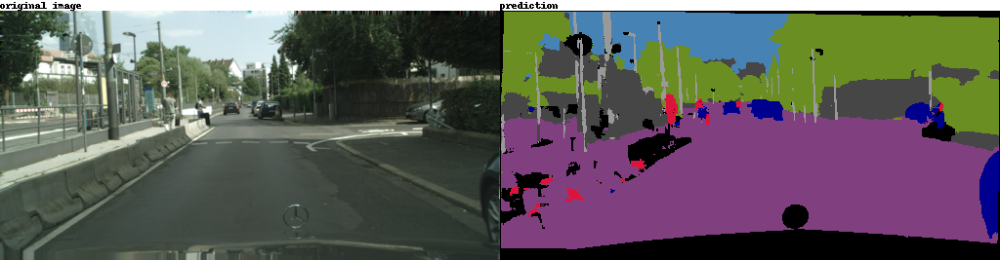

# semantic-segmentation

## 概要

semantic segmentation を行うスクリプトを作成する。
本スクリプトを実行する前に、setup.md を参考に実行環境の準備を行う必要がある。

## 推論結果・評価結果

### 推論結果
#### 成功例①

車・植生・建物・路面が綺麗に分割できている。

#### 成功例②

人間の識別が割とうまく行っている。

#### 失敗例

路肩のブロックを路面と混同している。

### 評価結果
各クラスごとに、以下のmetricで評価を行った。

* iou
* precision
* recall
* f1_score

定量的な評価結果は以下の通り。（2020.4.12時点の評価）
||iou|precision|recall|f1_score|
|-|-|-|-|-
|void|0.7452|0.8923|0.816|0.8518|
|flat|0.9268|0.9404|0.9554|0.9477|
|construction|0.7721|0.8414|0.8841|0.862|
|object|0.4276|0.646|0.5486|0.5927|
|nature|0.8152|0.8779|0.8898|0.8837|
|sky|0.7376|0.7853|0.8007|0.7925|
|human|0.4292|0.5577|0.5749|0.5645|
|vehicle|0.7519|0.8516|0.8338|0.8423|
|average|0.7007|0.7991|0.7879|0.7934|

## スクリプト実施手順

本スクリプトの実施手順は以下の通り。

### データ準備

データは [Cityscapes Dataset](https://www.cityscapes-dataset.com/) を使用する。

事前に会員登録を済ませ、以下の手順でデータのダウンロードを行う。

ダウンロードコマンドは以下の通り。

``` shell
wget --keep-session-cookies --save-cookies=cookies.txt --post-data 'username={ユーザー名}&password={パスワード}&submit=Login' https://www.cityscapes-dataset.com/login/
wget --load-cookies cookies.txt --content-disposition https://www.cityscapes-dataset.com/file-handling/?packageID=1
wget --load-cookies cookies.txt --content-disposition https://www.cityscapes-dataset.com/file-handling/?packageID=3
```

これにより、

* gtFine_trainvaltest.zip
* leftImg8bit_trainvaltest.zip

が手元にダウンロードされる。

{本リポジトリの絶対パス}直下に `data` ディレクトリを作成し、そこに解凍する。

``` shell
unzip -d {本リポジトリの絶対パス}/data gtFine_trainvaltest.zip
unzip -d {本リポジトリの絶対パス}/data leftImg8bit_trainvaltest.zip
```

データの仕様については、Appendix.に記載する。(TBA)

### 処理フロー

1. 前処理
   - ダウンロードした画像のリサイズ（縮小）
   - RGB 画像を LABEL 画像に変換
2. 画像データの TFRecord 化
3. データ生成・Augumentation
4. 学習
5. 評価
6. 推論

#### 1. 前処理

`src/preprocess.py` で実施。
EC2の `c5.xlarge` インスタンスで実行する想定。

``` shell
docker build -t cpu_env --rm=true docker/cpu_env/
docker run -it --rm --name cpu_env -v /work/semantic-segmentation/:/work cpu_env
python src/preprocess.py
```

#### 2. 画像データの TFRecord 化

`src/create_tfrecord.py` で実施。
EC2の `p2.xlarge` インスタンスで実行する想定（またはGoogle Colab）。

``` shell
docker build -t gpu_env --rm=true docker/gpu_env/
docker run --gpus all -it --rm --name gpu_env -v /work/semantic-segmentation/:/work gpu_env
python src/create_tfrecord.py
```

#### 3.データ生成・Augumentation

`src/data_generator.py` で実施。
`src/train.py` , `src/inference.py` , `src/evaal.py` で呼び出される。

#### 4. 学習

`src/train.py` で実施。
EC2の `p2.xlarge` インスタンスで実行する想定（またはGoogle Colab）。

``` shell
docker build -t gpu_env --rm=true docker/gpu_env/
docker run --gpus all -it --rm --name gpu_env -v /work/semantic-segmentation/:/work gpu_env
python src/train.py
```

#### 5. 評価

`src/eval.py` で実施。
EC2の `p2.xlarge` インスタンスで実行する想定（またはGoogle Colab）。

``` shell
docker build -t gpu_env --rm=true docker/gpu_env/
docker run --gpus all -it --rm --name gpu_env -v /work/semantic-segmentation/:/work gpu_env
python src/eval.py
```

#### 6. 推論

`src/inference.py` で実施。
EC2の `p2.xlarge` インスタンスで実行する想定（またはGoogle Colab）。

``` shell
docker build -t gpu_env --rm=true docker/gpu_env/
docker run --gpus all -it --rm --name gpu_env -v /work/semantic-segmentation/:/work gpu_env
python src/inference.py {出力画像数} {train/test/val}
```